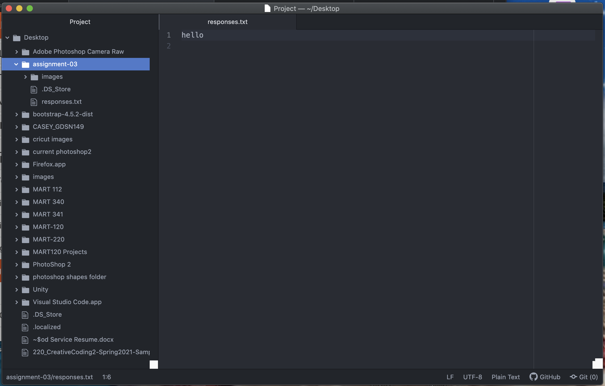

# Assignment3 Markdown Heading

[Favorite Website](https://greatpyrrescuemt.rescuegroups.org)

[Responses](./responses.txt)

## 3 Things Learned Thus Far

I have learned how to create a repository in GitHub, the basic use of Atom, and definitions relating to websites.
