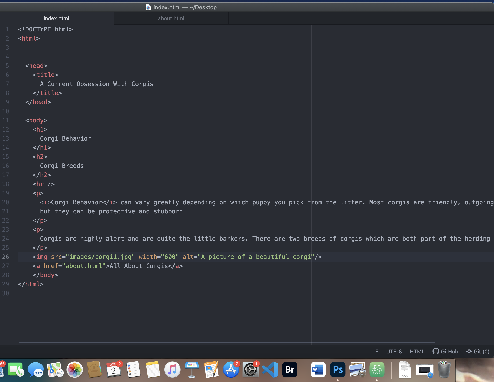
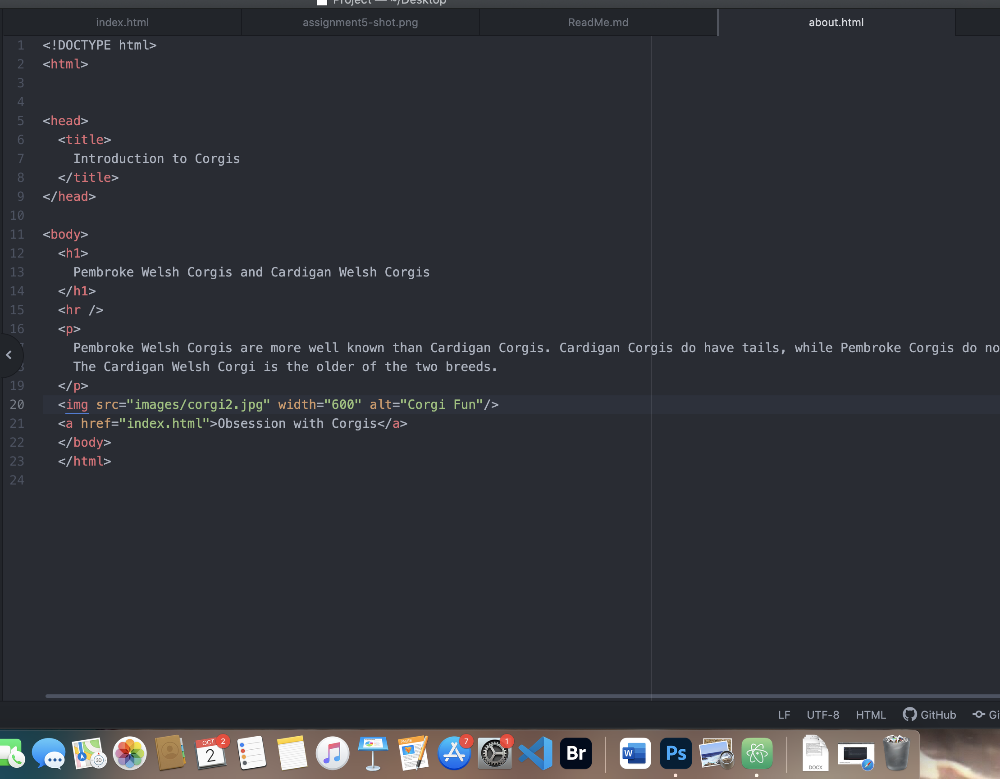

# Assignment5

In the Wayback Machine I selected zillow.com from February 2015.
The Zillow format has changed significantly in both style and function.  Headings,
sub-headings, and photographs are all sized and formatted differently. In the latest
version from 2022, many more links to relevant data are available to chose from; i.e.buy,
rent, home loans and agents, etc..  These selections were limited in the
Wayback version. Now live webcams and 3D renderings show the house versus basic
rolling photos from Wayback.  Actual housing data (pricing and status)is updated frequently.

