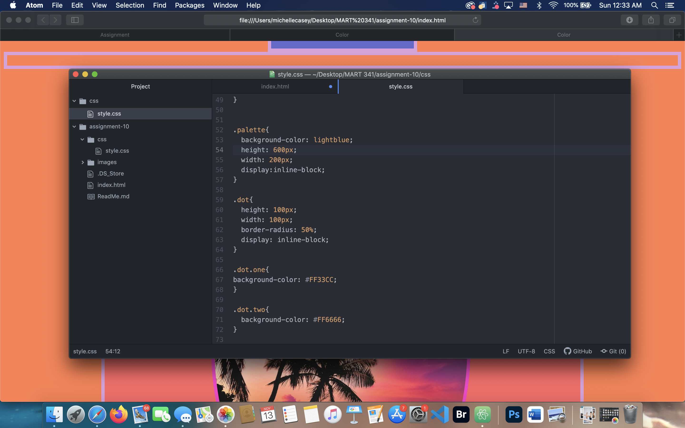

# Assignment-10

The universal selector type will apply to every element in a document.

The class selector will apply to an element when that element has been given a value and it will match the given value which has been specified after the period symbol.

The id selector type will apply to elements when they’ve been given a value which matches one specified after the pound or hashtag symbol.

The element selector is used to select HTML elements that require style via CSS. An element selector will say the name of the HTML element and it will contain CSS properties inside of brackets{}.

