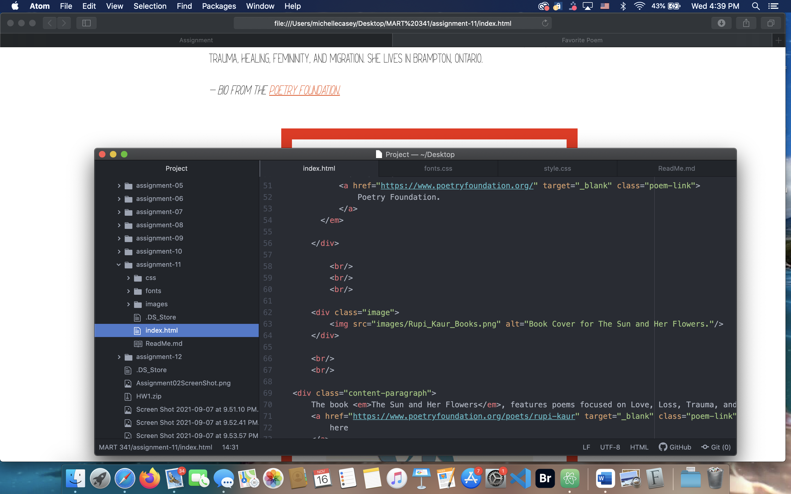

# Assignment-11

Typography includes font-family, size, weight, and style and how you choose to arrange the type on a page. The spacing between letters and lines also play a role in how your text will appear.

It is important to have a fallback, or several fallback fonts, because no font is guaranteed to be 100% web safe. Some fonts will have issues of readability, therefore, a backup font is needed.

A system font, which can also be referred to as a web-safe font, is a font that is already on devices of the general population. These are fonts assumed to be on the majority of users devices. It doesn't require the user to download a web font to be able to see text. A web font is a font that needs to be downloaded in order to be seen on a device. A web font is a font that is not commonly seen or used. To visually see the text written in that font, a user would need to download that specific font.

