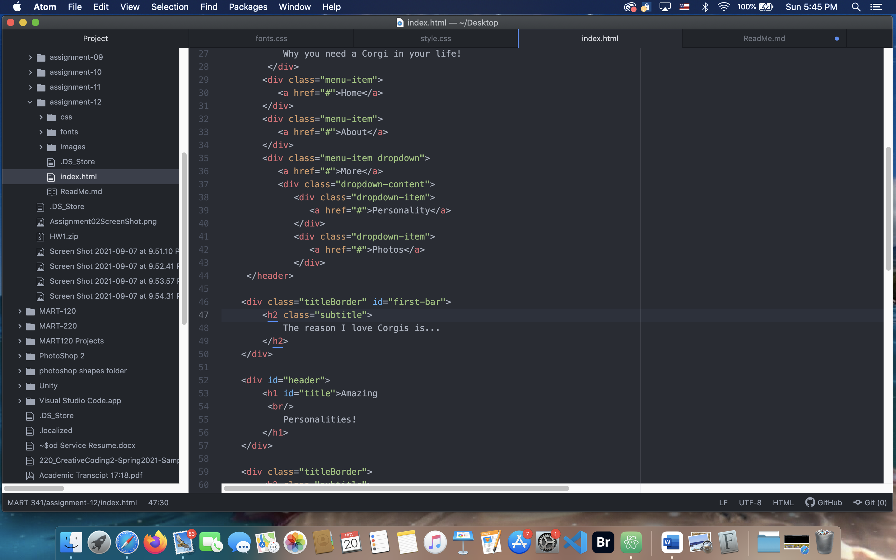

# Assignment-12

The difference between padding, border, and margin is that the padding refers to the space between content and border. The border refers to the strip that goes around your div element of content, and margin refers to the space outside of the border. All three combined together will equal the entire space.

